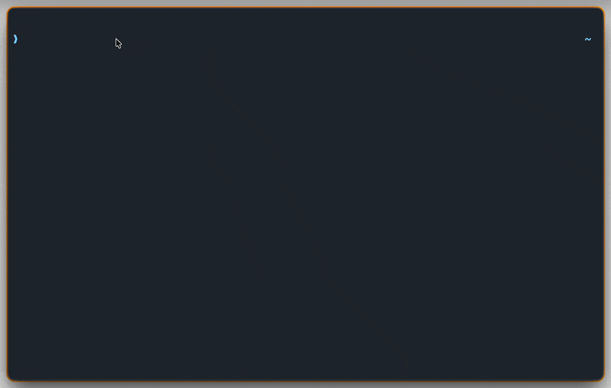

# typr

A terminal-based typing test.

> **Attribution**: typr is a fork of [tt](https://github.com/lemnos/tt) by Aetnaeus, used under the MIT License. See [NOTICE](NOTICE) for details.



# Installation

## From Source (Recommended)

```bash
# Install latest release binary
go install github.com/francojc/typr@latest
```

## From Source

```bash
git clone https://github.com/francojc/typr
cd typr
make && sudo make install
```

## Uninstall

```bash
sudo rm /usr/local/bin/typr /usr/share/man/man1/typr.1.gz
```

Best served on a terminal with truecolor and cursor shape support (e.g kitty, iterm)

# Usage

By default 50 words from the top 1000 words in the English language are used to
constitute the test. Custom text can be supplied by piping arbitrary text to the
program. Each paragraph in the input is shown as a separate segment of the text.
See `man typr` or `man.md` for a complete description and a comprehensive set of
options.

## Keys

- Pressing `escape` at any point exits the test.
- Pressing `tab` restarts the current test or starts a new test after completion.
- `C-w` deletes the previous word during typing.

## Examples

 - `typr -quotes en` Starts quote mode with the builtin quote list 'en'.
 - `typr -quotes` Fetches a random quote from the ZenQuotes API (cached locally).
 - `typr -quotefile zen` Uses a locally cached quote from previous ZenQuotes API sessions (offline).
 - `typr -n 10 -g 5` produces a test consisting of 50 randomly drawn words in 5 groups of 10 words each.
 - `typr -t 10` starts a timed test lasting 10 seconds.
 - `typr -theme gruvbox` Starts typr with the gruvbox theme.

`typr` is designed to be easily scriptable and integrate nicely with
other *nix tools. With a little shell scripting most features the user can
conceive of should be possible to implement. Below are some simple examples of
what can be achieved.

 - `shuf -n 40 /usr/share/dict/words|typr`  Produces a test consisting of 40 random words drawn from your system's dictionary.
 - `typr -csv -oneshot` Runs a single test and saves results to `~/.local/share/typr/results/`.

The default behaviour is equivalent to `typr -n 50`.

See `-help` for an exhaustive list of options.

## Progress Visualization

Track your typing speed improvement over time with terminal graphs:

```bash
# Visualize with just filename (looks in results directory)
typr visualize quotes-stats.csv
typr visualize words-stats.csv

# Or with full path
typr visualize ~/.local/share/typr/results/quotes-stats.csv
```

The visualization shows your min, mean, and max WPM by day over the last 30 days.
Run tests with the `-csv` flag to generate data for visualization.

## Configuration

### YAML Configuration File

`typr` creates a configuration file automatically on first run at `$XDG_CONFIG_HOME/typr/config.yaml` or `~/.config/typr/config.yaml`:

```yaml
# typr - Typing Test Configuration
#
# This file contains default settings for typr.
# Command-line flags override these settings.
#
# Config path: $XDG_CONFIG_HOME/typr/config.yaml or ~/.config/typr/config.yaml

# Word/Quote Mode
words: "1000en"
quotes: ""

# Test Parameters
n: 50
g: 1
start: -1
w: 80
t: -1

# Display Options
theme: "default"
showwpm: false
notheme: false
blockcursor: false
bold: false

# Behavior Options
noskip: false
nobackspace: false
nohighlight: false
raw: false
multi: false

# Output Options
csv: true
csvdir: "~/.local/share/typr/results"
json: false
oneshot: false
noreport: false
```

If `XDG_DATA_HOME` is set, generated config uses `$XDG_DATA_HOME/typr/results` instead.

### Custom Themes and Word Lists

Custom themes, word lists, and quotes can be defined in `~/.config/typr/themes`, `~/.config/typr/words`, and `~/.config/typr/quotes`
and used in conjunction with the `-theme`, `-words`, and `-quotefile` flags. A list of
preloaded themes and word lists can be found in `words/` and `themes/` and are
accessible by default using the respective flags.

### CSV Output Directory

By default, `typr` writes results to `$XDG_DATA_HOME/typr/results/` or `~/.local/share/typr/results/`:

- Stats: `{mode}-stats.csv` (timestamp, wpm, cpm, accuracy, n)
- Errors: `{mode}-errors.csv` (timestamp, word, error)

To customize output directory, set `csvdir` in `config.yaml`:

```yaml
csvdir: "~/Documents/typing-stats"
```

The tilde (`~`) will be expanded to your home directory. Paths can be absolute or relative to your home.

## ZenQuotes and Offline Mode

`typr -quotes` fetches inspirational quotes from the [ZenQuotes API](https://zenquotes.io/). Each fetched quote is automatically cached to `~/.local/share/typr/quotes/zenlog.json` (unique quotes only, no duplicates).

When the API is unavailable (network issues, rate limiting, etc.), typr falls back automatically to:

1. In-memory quote cache (current session)
2. Previously cached quotes from zenlog
3. Built-in default quote if no cache exists

To explicitly use only locally cached quotes (no network), use `-quotefile zen`:

```bash
typr -quotefile zen
```

This reads exclusively from the zenlog cache. If the cache is empty, typr will prompt you to run `typr -quotes` first to populate it.
